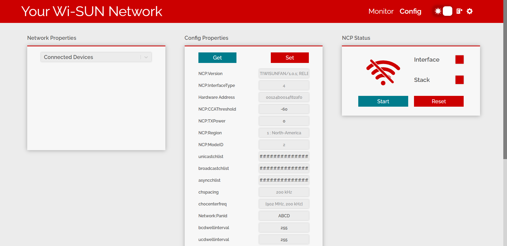

# Description

The utdesign-ti-wisunfan-webserver provides a configuration and realtime
monitoring solution for TI's WiSUN offerings.

# Getting Started

- Install [wfantund](https://github.com/TexasInstruments/ti-wisunfantund)

- Download latest [release](https://github.com/Stephen-Campbell-UTD/utdesign-ti-wisunfan-webserver/releases)

# Usage

- Run `./utdesign-ti-wisunfan-webserver.out `This will start a webserver on port
  80 (port can be configured with `--port <port-number>` flag)

- Connect Border Router and turn on network nodes. Make sure device appears at
  `/dev/ttyACM0`. If this is not possible, the device file path can be configured with the `--serial-port <filepath>` flag.

- The network configuration tab will appear. This allows you to configure
  properites of ncp properties. The explanation behind these properties can be
  found
  [here](https://dev.ti.com/tirex/explore/content/simplelink_cc13x2_26x2_sdk_5_20_00_52/docs/ti_wisunfan/html/wisun-guide/NWP_interface.html#:~:text=TI%20Wi%2DSUN%20FAN%20NWP%20Properties).

  

- After the border router has started its network, the network nodes should be
  given a few minutes to connect. Once the nodes connect, they will appear in the
  monitor tab. This tab allows this network to be monitored for latency, success rate, and topology.

  

**Tips**

- Run `./utdesign-ti-wisunfan-webserver.out --help` to get in-depth
  configuration options.

- Logs generated by wfantund and server iteself are dumped in the `/tmp/utdesign-ti-wisunfan-webserver/logs/` directory.

# Developing

**Prerequisites**

- Install [wfantund](https://github.com/TexasInstruments/ti-wisunfantund)

- Install [Node.js](https://nodejs.org/en/) v16.13.2

  - **Important** If using sudo, Node v16.13.2 must be in the sudo path e.g. in /usr/bin/

- Install each client/server dependences
  For Client:
  ```bash
  cd <project-root>/client
  npm install
  ```
  For Server:
  ```bash
  cd <project-root>/server
  npm install
  ```

# Notes

This project is a part of UTDesign capstone project.
